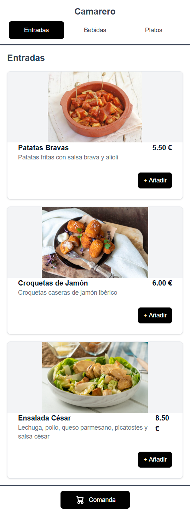
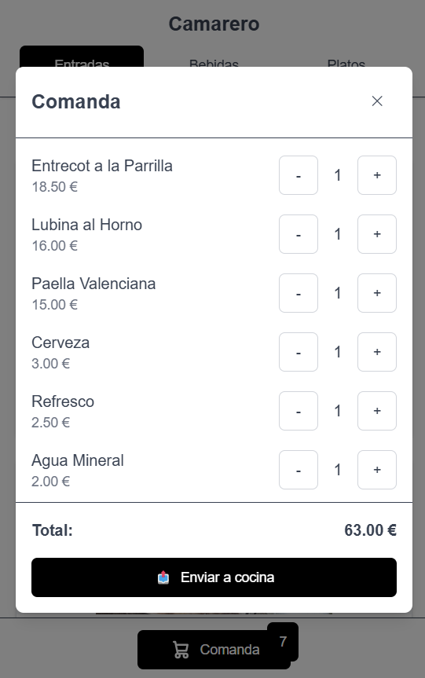
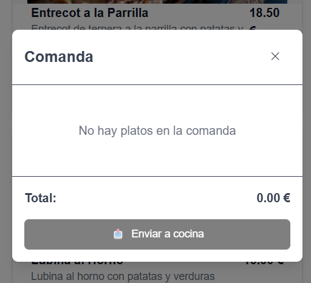

# Camarero

Digitalización de servicios de restaurantes.

## Instalación

Clona el repo e ingresa a la carpeta:

```bash
git clone https://github.com/Aron1244/Camarero
cd Camarero
```

Instala las dependencias:

```bash
npm install
```

Inicia el servidor de desarrollo:

```bash
npm run dev
# or
yarn dev
# or
pnpm dev
# or
bun dev
```

Ve a [http://localhost:3000](http://localhost:3000) en tu navegador y verás el sitio web.

## Capturas de pantalla

### Primer diseño de un posible menú

<div align="center">
  
</div>

---

### Comanda con diferentes pedidos

<div align="center">
  
</div>

---

### Comanda sin pedidos

<div align="center">
  
</div>

---

## Referencias

- [Next.js Documentation](https://nextjs.org/docs) - learn about Next.js features and API.
- [Learn Next.js](https://nextjs.org/learn) - an interactive Next.js tutorial.
- [Next.js deployment documentation](https://nextjs.org/docs/app/building-your-application/deploying) for more details.
- [Vercel Platform](https://vercel.com/new)


